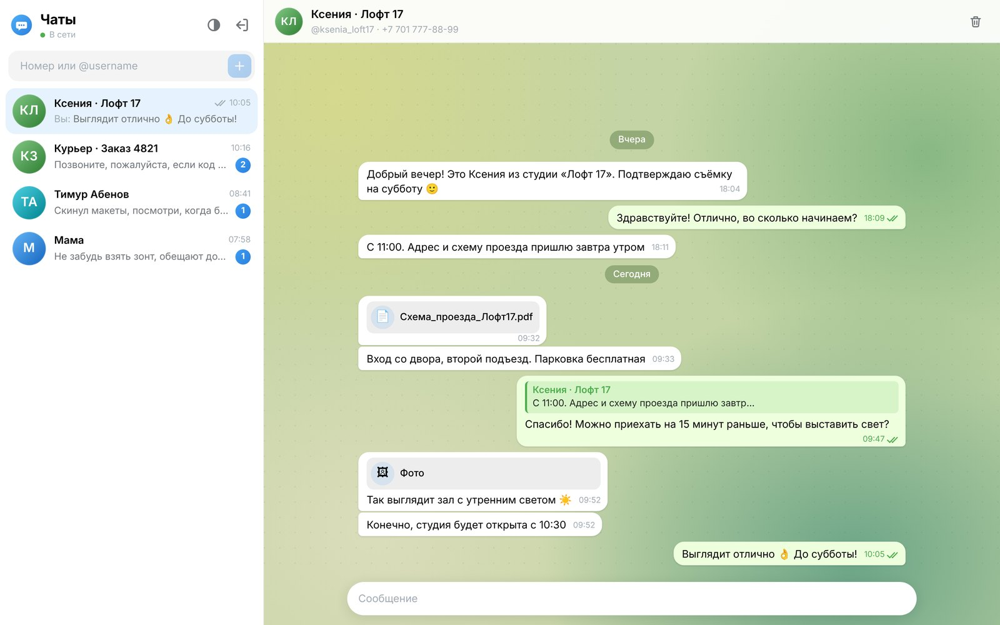
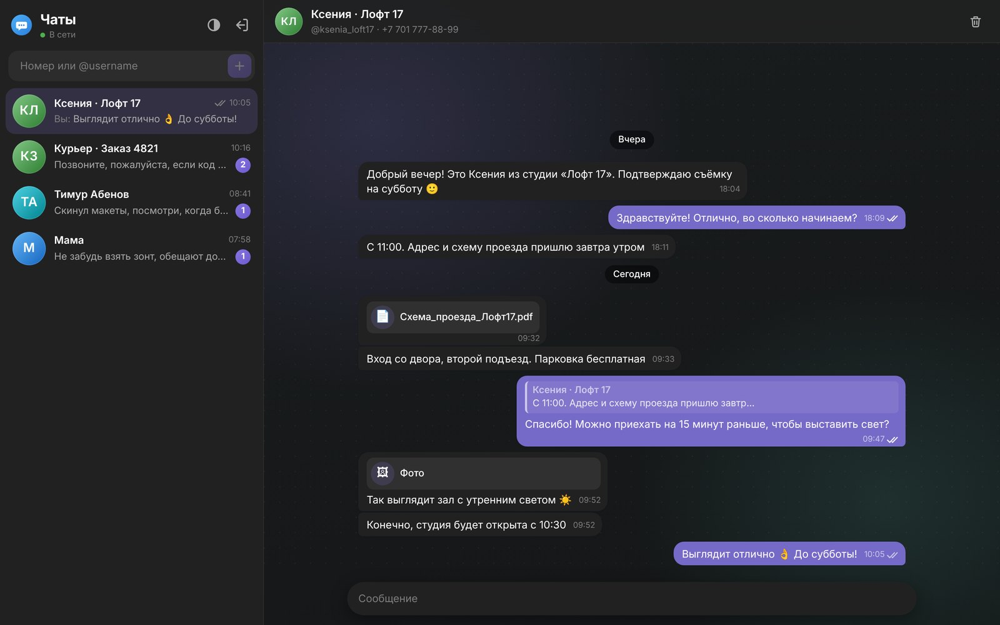
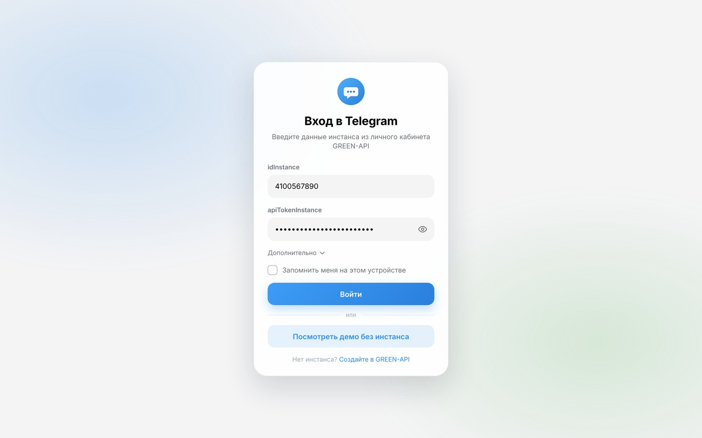
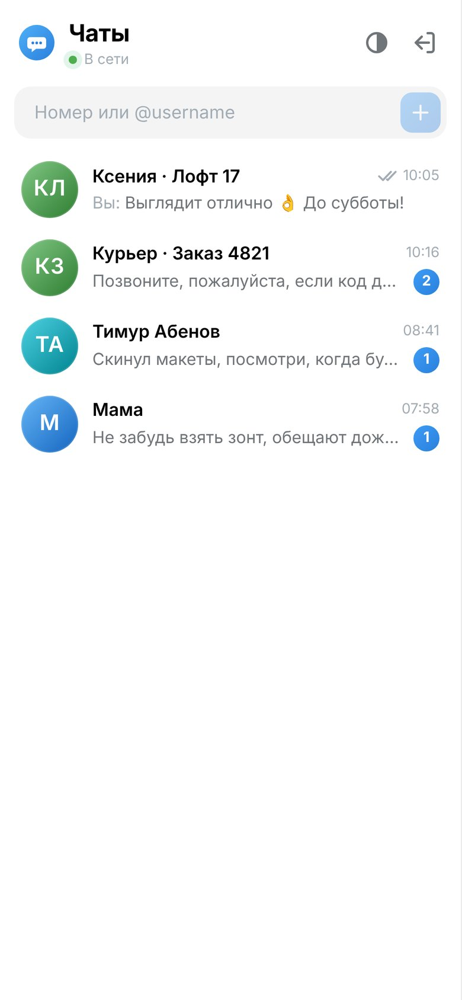
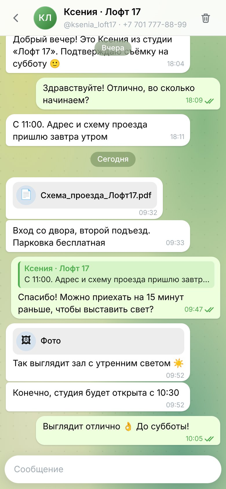
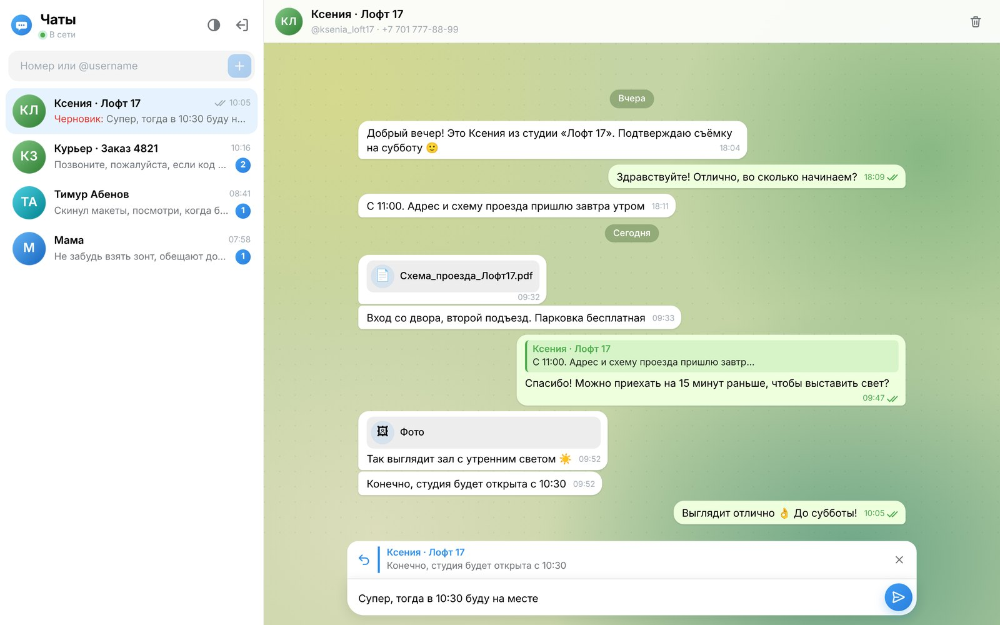
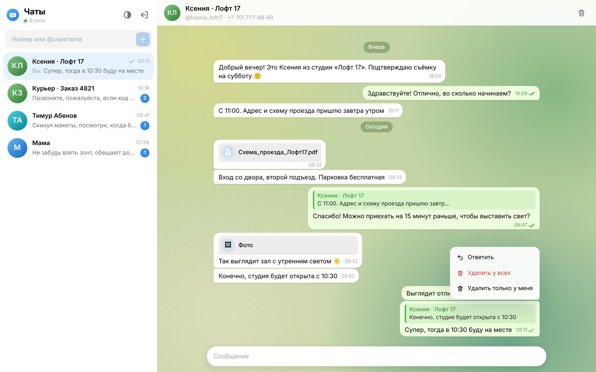
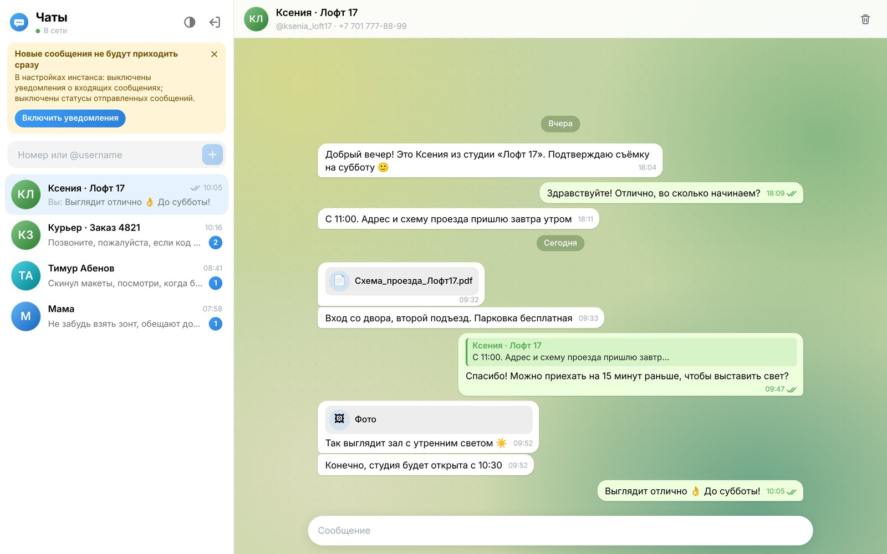
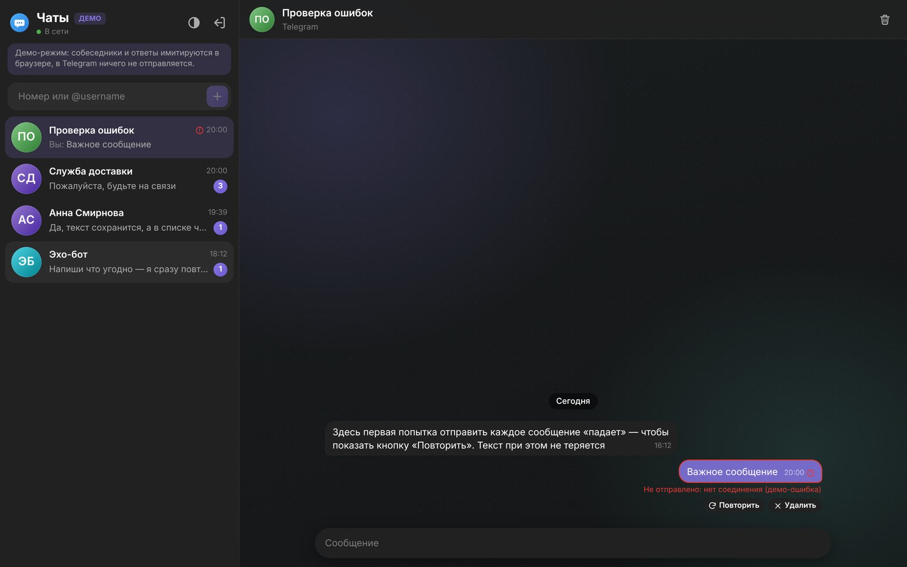

# Telegram Chat · GREEN-API

Веб-клиент для отправки и получения текстовых сообщений в **Telegram** через [GREEN-API](https://green-api.com/telegram).

ТЗ разрешает вместо MAX сделать клиент для WhatsApp или Telegram. Выбран Telegram, поэтому прототипом интерфейса взят не web.max.ru, а [Telegram Web](https://web.telegram.org/): обои, зелёные исходящие сообщения, фиолетовый акцент в тёмной теме.

**Онлайн:** https://zxcbecause.github.io/telegram-chat/ · **Демо без инстанса:** https://zxcbecause.github.io/telegram-chat/?demo
**Запуск локально:** [docs/SETUP.md](docs/SETUP.md) · **Стек:** React 18, TypeScript, Vite, Framer Motion, Vitest, MSW, Playwright

| Светлая тема | Тёмная тема |
| --- | --- |
|  |  |

<p>
  
  
  
</p>

<details>
<summary>Ещё скриншоты (меню, ответ, баннер настроек, повтор отправки)</summary>

| | |
| --- | --- |
|  |  |
|  |  |
|  | |

Все чаты на скриншотах вымышленные.
</details>

## Демо-режим

Чтобы посмотреть интерфейс без своего инстанса, нажмите на экране входа **«Посмотреть демо без инстанса»** или откройте ссылку с `?demo`. Слева появятся тестовые чаты, собеседники и их ответы имитируются прямо в браузере, в GREEN-API и Telegram ничего не отправляется:

- **Анна Смирнова** — статусы 🕓 → ✓ → ✓✓ → прочитано, ответы с цитатой, разделители по датам;
- **Служба доставки** — несколько непрочитанных входящих;
- **Эхо-бот** — сразу повторяет ваше сообщение, удобно проверять приём;
- **Проверка ошибок** — первая попытка отправки «падает», чтобы показать кнопку «Повторить».

Демо подменяет только источник данных: `DemoClient` реализует тот же интерфейс, что и настоящий клиент GREEN-API (очередь уведомлений с `receiptId`, вебхуки статусов, история). Поэтому в демо работают тот же цикл получения, reducer и UI, что и с настоящим инстансом.

## Как это работает

1. Пользователь вводит `idInstance` и `apiTokenInstance`. Данные сразу проверяются через `getStateInstance`: неверный токен или неавторизованный инстанс отсекаются на входе, с понятной ошибкой.
2. Пользователь вводит номер получателя (или `@username`) → номер нормализуется → [`checkAccount`](https://green-api.com/telegram/docs/api/service/CheckAccount/) возвращает `chatId` в Telegram. Если аккаунта нет или номер скрыт настройками приватности, об этом сообщается сразу, а не после отправки.
3. Отправка — [`SendMessage`](https://green-api.com/telegram/docs/api/sending/SendMessage/).
4. Получение — [HTTP API](https://green-api.com/telegram/docs/api/receiving/technology-http-api/): цикл `receiveNotification` (long polling) → обработка → `deleteNotification`.

## Функции

Интерфейс намеренно минимальный (п. 5 ТЗ). Все дополнения — про удобство и надёжность, а не новые кнопки, и все работают через реальные методы API:

- **История чата** при открытии (`getChatHistory`) со скелетоном загрузки.
- **Статусы сообщений:** отправляется → отправлено → доставлено → прочитано (`outgoingMessageStatus`). Статус никогда не «откатывается» назад.
- **Ответ на сообщение** (`quotedMessageId`) — правый клик → «Ответить» или двойной клик; клик по цитате прокручивает к оригиналу.
- **Повтор отправки:** если сообщение не ушло, текст не теряется — «Повторить» или «Удалить».
- **Индикатор соединения и состояния инстанса**: «В сети / Переподключаемся…», баннер, если инстанс разлогинился (`stateInstanceChanged`).
- **Входящие от новых собеседников** автоматически появляются в списке чатов со счётчиком непрочитанных; имя берётся из Telegram.
- **Чат по `@username`** — в Telegram номер часто скрыт, поэтому `checkAccount` вызывается и по username.
- **Нормализация номера и маска ввода:** `+7 (700) 123-45-67`, `87001234567`, `7001234567` → один формат; номера других стран принимаются в международном формате.
- **Проверка настроек инстанса** (`getSettings`): если выключены уведомления о входящих или задан Webhook URL, сообщения «вживую» не придут. Приложение предупреждает об этом и включает нужное одной кнопкой (`setSettings`).
- **Подстраховка для открытого чата:** раз в 20 с и при возвращении на вкладку история тихо сверяется с `getChatHistory`, без скелетона и прыжков прокрутки, дубли склеиваются по `idMessage`. Основной канал по-прежнему `receiveNotification`.
- **Файлы и медиа подписаны:** клиент работает только с текстом (п. 3 ТЗ), но вместо безликого «вложения» показывает тип и имя файла («📄 отчёт.xlsx», «🖼 Фото»), а подпись к файлу — как обычный текст.
- **Только личные чаты:** сообщения из групп и каналов личного аккаунта не засоряют список.
- **Действия через правый клик** (на телефоне — долгое нажатие), без лишних кнопок в интерфейсе:
  - по сообщению: «Ответить», «Удалить у всех», «Удалить только у меня» ([`deleteMessage`](https://green-api.com/telegram/docs/api/service/DeleteMessage/)). Удалять можно только свои сообщения — чужие API не позволяет;
  - по чату в списке: «Удалить чат» с подтверждением (то же — кнопкой с корзиной в шапке чата). Чат убирается только из списка, переписка в Telegram остаётся: такого метода в API нет.
- **Черновики** сохраняются при переключении чатов.
- **«Запомнить меня»** (по умолчанию выключено): сессия и чаты переживают перезагрузку страницы.
- Разделители по датам, кнопка «вниз» со счётчиком новых сообщений, Enter — отправить, Shift+Enter — новая строка, Esc — отменить ответ.
- Светлая / тёмная / системная тема, адаптив под телефон, `prefers-reduced-motion`.

## Запуск

Подробная пошаговая инструкция (с созданием инстанса и решением проблем) — в [docs/SETUP.md](docs/SETUP.md).

Нужен **Node.js 22.12+** (`node -v`; версия также в `.nvmrc`).

```bash
npm install
npm run dev        # http://localhost:5173
```

```bash
npm test               # unit + интеграционные тесты (Vitest + MSW)
npm run test:coverage  # то же с отчётом о покрытии
npm run test:e2e       # e2e в настоящем браузере (Playwright)
npm run lint
npm run typecheck
npm run build          # статическая сборка в dist/
```

`dist/` — обычная статика (`base: './'`). Каждый пуш в `main` публикуется на GitHub Pages workflow-ом [`deploy.yml`](.github/workflows/deploy.yml).

### Настройка инстанса GREEN-API

В [личном кабинете](https://console.green-api.com/) у инстанса должно быть:

- состояние **authorized** (QR-код отсканирован в Telegram: Настройки → Устройства → Подключить устройство);
- **пустое поле Webhook URL** — иначе HTTP API не отдаёт уведомления;
- включены уведомления о входящих сообщениях (`incomingWebhook`); для статусов и сообщений, отправленных с телефона — `outgoingWebhook`, `outgoingAPIMessageWebhook`, `outgoingMessageWebhook`.

API URL подставляется автоматически по первым 4 цифрам `idInstance`. Если в кабинете указан другой — его можно поменять в разделе «Дополнительно» на экране входа.

## Архитектура

```
src/
├── api/
│   ├── greenApi.ts        # типизированный клиент GREEN-API, понятные ошибки
│   ├── mappers.ts         # webhook / история → модель сообщения
│   └── types.ts
├── state/
│   └── chatReducer.ts     # чистый reducer: дедупликация, порядок, статусы
├── hooks/
│   ├── useNotifications.ts  # цикл long polling
│   ├── useChat.ts           # действия чата + сохранение
│   ├── useSession.ts        # вход / выход
│   └── useTheme.ts
├── components/            # UI в стиле Telegram Web
└── lib/                   # телефон, даты, localStorage
```

Несколько решений, которые стоит отметить:

- **Получение уведомлений.** В каждый момент выполняется ровно один запрос `receiveNotification`. Каждое уведомление подтверждается через `deleteNotification`, даже если его тип нам не нужен, — иначе очередь встанет. Ошибки сети — экспоненциальная пауза (1 → 15 с) и мгновенный реконнект при событии `online`. Цикл останавливается через `AbortController` при выходе.
- **Гонки.** Вебхук `outgoingAPIMessageReceived` и статус `delivered` могут прийти раньше, чем HTTP-ответ `sendMessage`. Reducer это учитывает: сообщения не дублируются, «ранние» статусы применяются, как только становится известен `idMessage`.
- **Порядок сообщений и часы.** Время сообщений с сервера идёт по часам GREEN-API, а только что отправленного — по часам компьютера. Если они расходятся хотя бы на пару минут, своё сообщение при пересортировке уезжает вверх и «пропадает». Поэтому приложение оценивает разницу часов по свежим уведомлениям, никогда не ставит новое сообщение выше последнего и заменяет время на серверное, как только оно приходит (эхо-вебхук или история). Сортировка по секундам стабильная, чтобы быстрый ответ не «прыгал» выше вопроса.
- **Логика отделена от UI.** Reducer — чистая функция без React, поэтому самые хрупкие сценарии покрыты простыми unit-тестами.

## Тесты

**120 unit- и интеграционных тестов** (Vitest + Testing Library + [MSW](https://mswjs.io/) как фейковый GREEN-API), покрытие строк ~96 %, и **9 e2e-сценариев** в настоящем Chromium, на десктопе и в мобильном viewport.

| Файл | Что проверяет |
| --- | --- |
| `App.test.tsx` | Сценарий из ТЗ целиком: вход → чат по номеру / `@username` → отправка → ответ через `receiveNotification` → «прочитано»; удаление; настройки инстанса |
| `chat.test.tsx` | Ошибка отправки и «Повторить», ответы, Shift+Enter, лимит 4096, непрочитанные, черновики, фильтр групп, сообщения с телефона, статус `noAccount`, разлогин инстанса, кэш «номер не найден», ошибки удаления, меню, ошибка истории |
| `session.test.tsx` | Валидация входа, запрет отправки токена на чужой домен, состояния инстанса, «Запомнить меня» и выход (ничего не остаётся в браузере), испорченный `localStorage`, тема, индикатор соединения |
| `chatReducer.test.ts` | Гонки вебхуков, статусы только вперёд, расхождение часов, слияние истории, удаление |
| `greenApi.test.ts` | Формат запросов, экранирование токена в URL, все коды ошибок, ответы-цитаты в разных форматах, файлы, фильтр групп |
| `hooks.test.tsx` | Цикл уведомлений: порядок, подтверждение даже при ошибке, backoff, `online`, 401, остановка при выходе; долгое нажатие |
| `lib.test.ts`, `phone.test.ts` | Даты, подписи вложений, хранилище, номера и `@username` |
| `demo.test.tsx` | Демо-режим, ссылка `?demo`, работа без единого сетевого запроса |
| `e2e/app.spec.ts` | Раскладка с длинной историей и прокрутка, новые сообщения вживую, XSS, CSP без нарушений, обрыв и восстановление сети, правый клик / долгое нажатие, отсутствие горизонтального скролла, демо |

CI (GitHub Actions) на каждый push запускает lint, typecheck, unit-тесты, сборку и e2e.

## Безопасность

- **Токен.** `apiTokenInstance` по умолчанию хранится только в памяти вкладки. В `localStorage` он попадает лишь при включённом «Запомнить меня», а «Выйти» стирает и его, и переписку.
- **Куда уходит токен.** Только на `https://*.green-api.com`: поле API URL валидируется, сохранённая сессия с чужим адресом игнорируется, а `idInstance` и токен экранируются в пути запроса.
- **Content-Security-Policy** в продакшен-сборке: скрипты и стили только с этого сайта, сетевые запросы только к GREEN-API, `object-src 'none'`.
- **XSS.** Текст сообщений выводится только как текст (React), без `innerHTML`; e2e-тест проверяет это на сообщении с `<script>` и `onerror`.
- **Бережно к аккаунту.** Отрицательный результат `checkAccount` кэшируется на 10 минут: GREEN-API предупреждает, что частые проверки одного номера могут привести к ограничениям.
- **Зависимости:** `npm audit` — 0 уязвимостей.

Ограничение by design: запросы идут из браузера напрямую в GREEN-API, поэтому токен виден в DevTools у самого пользователя. Для тестового задания это нормально. В продакшене токен должен жить на бэкенде: фронт ходит в свой API, а тот — в GREEN-API (заодно вместо polling можно использовать webhook).

## Что можно добавить дальше

- Бэкенд-прокси с вебхуками вместо long polling.
- Список существующих чатов из Telegram (`getChats`) и поиск по ним.
- Подгрузка старой истории при прокрутке вверх.
- Медиа и пересылка (`sendFileByUpload`, `forwardMessages`) — вне рамок ТЗ (только текст).
- Отметка прочтения входящих (`readChat`) и «печатает…» (`typingTime` в `sendMessage`).
