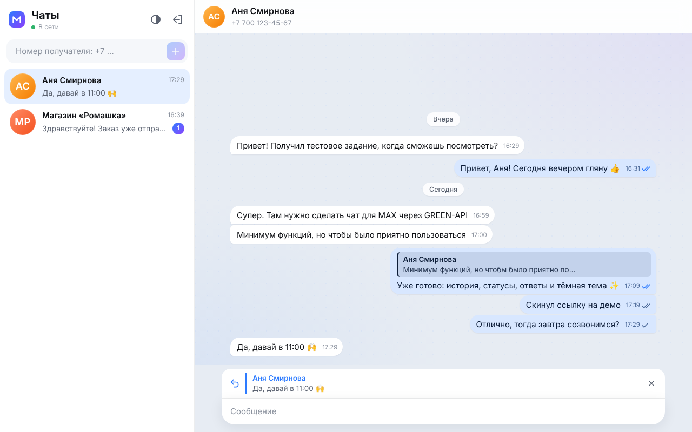
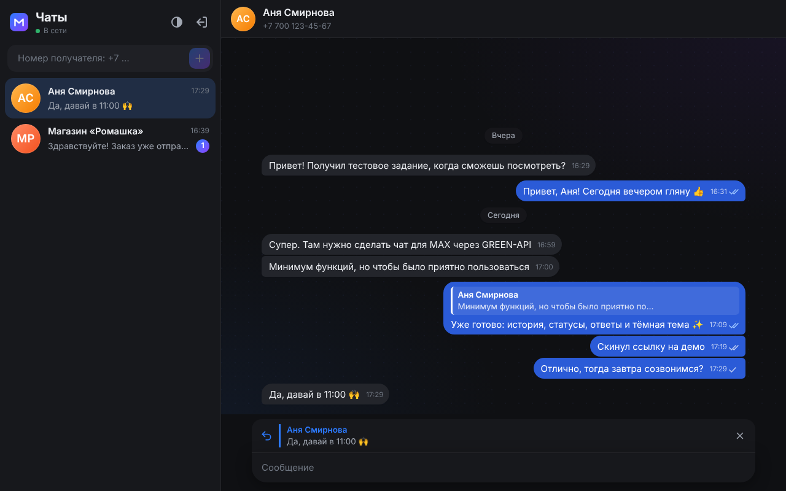
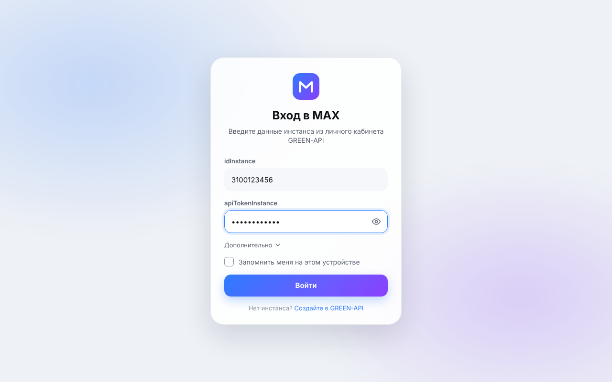
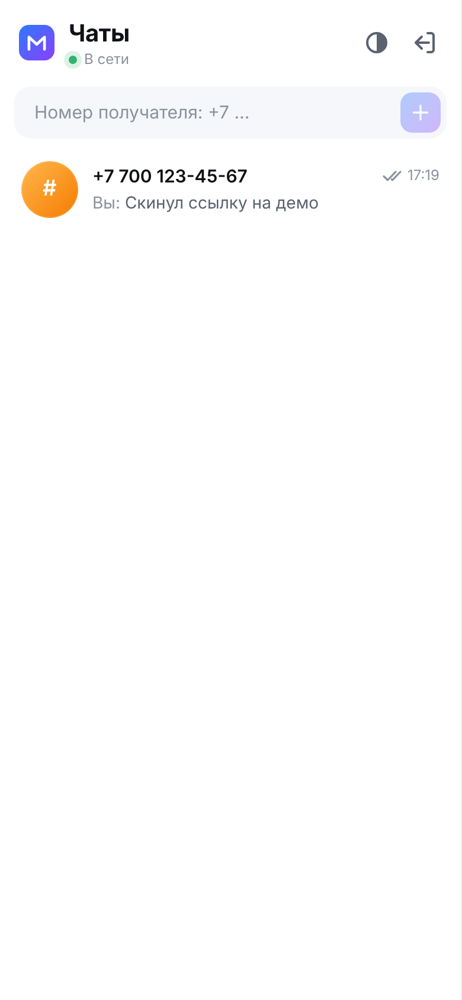
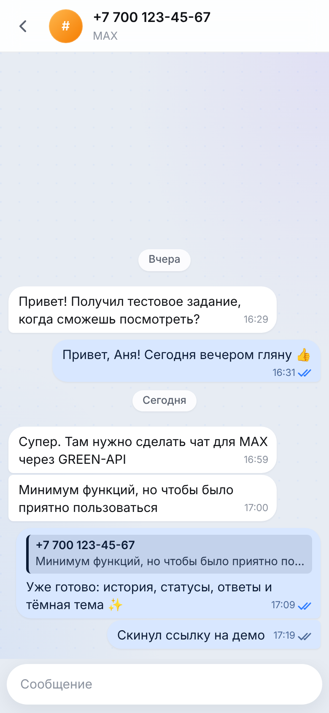

# MAX Chat · GREEN-API

Веб-клиент для отправки и получения текстовых сообщений в мессенджере **MAX** через [GREEN-API](https://green-api.com/max). Внешний вид повторяет [web.max.ru](https://web.max.ru/).

**Демо:** _ссылка на деплой_ · **Стек:** React 18, TypeScript, Vite, Framer Motion, Vitest, MSW

| Светлая тема | Тёмная тема |
| --- | --- |
|  |  |

<p>
  
  
  
</p>

## Как это работает

1. Пользователь вводит `idInstance` и `apiTokenInstance`. Данные сразу проверяются через `getStateInstance`: неверный токен или неавторизованный инстанс отсекаются на входе, с понятной ошибкой.
2. Пользователь вводит номер получателя → номер нормализуется → `checkAccount` возвращает `chatId` в MAX. Если аккаунта MAX нет, об этом сообщается сразу, а не после отправки.
3. Отправка — [`SendMessage`](https://green-api.com/v3/docs/api/sending/SendMessage/).
4. Получение — [HTTP API](https://green-api.com/v3/docs/api/receiving/technology-http-api/): цикл `receiveNotification` (long polling) → обработка → `deleteNotification`.

## Функции

Интерфейс намеренно минимальный (п. 5 ТЗ). Все дополнения — про удобство и надёжность, а не новые кнопки, и все работают через реальные методы API:

- **История чата** при открытии (`getChatHistory`) со скелетоном загрузки.
- **Статусы сообщений:** отправляется → отправлено → доставлено → прочитано (`outgoingMessageStatus`). Статус никогда не «откатывается» назад.
- **Ответ на сообщение** (`quotedMessageId`) — наведите на сообщение или дважды кликните; клик по цитате прокручивает к оригиналу.
- **Повтор отправки:** если сообщение не ушло, текст не теряется — «Повторить» или «Удалить».
- **Индикатор соединения и состояния инстанса**: «В сети / Переподключаемся…», баннер, если инстанс разлогинился (`stateInstanceChanged`).
- **Входящие от новых собеседников** автоматически появляются в списке чатов со счётчиком непрочитанных; имя берётся из MAX.
- **Нормализация номера и маска ввода:** `+7 (700) 123-45-67`, `87001234567`, `7001234567` → один формат.
- **Черновики** сохраняются при переключении чатов.
- **«Запомнить меня»** (по умолчанию выключено): сессия и чаты переживают перезагрузку страницы.
- Разделители по датам, кнопка «вниз» со счётчиком новых сообщений, Enter — отправить, Shift+Enter — новая строка, Esc — отменить ответ.
- Светлая / тёмная / системная тема, адаптив под телефон, `prefers-reduced-motion`.

## Запуск

```bash
npm install
npm run dev        # http://localhost:5173
```

```bash
npm test           # unit + интеграционные тесты
npm run lint
npm run typecheck
npm run build      # статическая сборка в dist/
```

`dist/` — обычная статика, деплоится на Vercel, Netlify или GitHub Pages без настройки (`base: './'`).

### Настройка инстанса GREEN-API

В [личном кабинете](https://console.green-api.com/) у инстанса должно быть:

- состояние **authorized** (QR-код отсканирован в приложении MAX);
- **пустое поле Webhook URL** — иначе HTTP API не отдаёт уведомления;
- включены уведомления о входящих сообщениях (`incomingWebhook`); для статусов и сообщений, отправленных с телефона — `outgoingWebhook`, `outgoingAPIMessageWebhook`, `outgoingMessageWebhook`.

API URL подставляется автоматически по первым 4 цифрам `idInstance`. Если в кабинете указан другой — его можно поменять в разделе «Дополнительно» на экране входа.

## Архитектура

```
src/
├── api/
│   ├── greenApi.ts        # типизированный клиент GREEN-API, понятные ошибки
│   ├── mappers.ts         # webhook / история → модель сообщения
│   └── types.ts
├── state/
│   └── chatReducer.ts     # чистый reducer: дедупликация, порядок, статусы
├── hooks/
│   ├── useNotifications.ts  # цикл long polling
│   ├── useChat.ts           # действия чата + сохранение
│   ├── useSession.ts        # вход / выход
│   └── useTheme.ts
├── components/            # UI в стиле MAX
└── lib/                   # телефон, даты, localStorage
```

Несколько решений, которые стоит отметить:

- **Получение уведомлений.** В каждый момент выполняется ровно один запрос `receiveNotification`. Каждое уведомление подтверждается через `deleteNotification`, даже если его тип нам не нужен, — иначе очередь встанет. Ошибки сети — экспоненциальная пауза (1 → 15 с) и мгновенный реконнект при событии `online`. Цикл останавливается через `AbortController` при выходе.
- **Гонки.** Вебхук `outgoingAPIMessageReceived` и статус `delivered` могут прийти раньше, чем HTTP-ответ `sendMessage`. Reducer это учитывает: сообщения не дублируются, «ранние» статусы применяются, как только становится известен `idMessage`.
- **Порядок сообщений.** У GREEN-API секундная точность временных меток, у локальных — миллисекундная. Сортировка идёт по секундам со стабильным порядком, чтобы быстрый ответ не «прыгал» выше вопроса.
- **Логика отделена от UI.** Reducer — чистая функция без React, поэтому самые хрупкие сценарии покрыты простыми unit-тестами.

## Тесты

- `chatReducer.test.ts` — отправка, гонки вебхуков, статусы, непрочитанные, слияние истории.
- `greenApi.test.ts` — URL методов, `deleteNotification/{token}/{receiptId}`, разбор ошибок, маппинг вебхуков.
- `phone.test.ts` — нормализация, форматирование и маска номера.
- `App.test.tsx` — сквозной сценарий из ТЗ против фейкового GREEN-API на [MSW](https://mswjs.io/): вход → создание чата по номеру → отправка → ответ получателя приходит через `receiveNotification` → статус «прочитано».

CI (GitHub Actions) на каждый push запускает lint, typecheck, тесты и сборку.

## Безопасность

`apiTokenInstance` по умолчанию хранится только в памяти вкладки. В `localStorage` он попадает лишь при включённом «Запомнить меня». Запросы идут из браузера напрямую в GREEN-API, поэтому токен виден в DevTools — для тестового задания это допустимо. В продакшене токен должен жить на бэкенде: фронт ходит в свой API, а тот — в GREEN-API (заодно вместо polling можно использовать webhook).

## Что можно добавить дальше

- Бэкенд-прокси с вебхуками вместо long polling.
- Несколько чатов из MAX сразу (`getChats`) и поиск по ним.
- Подгрузка старой истории при прокрутке вверх.
- Медиа и пересылка (`sendFileByUpload`, `forwardMessages`) — вне рамок ТЗ (только текст).
- Отметка прочтения входящих (`readChat`) и «печатает…» (`typingTime` в `sendMessage`).
